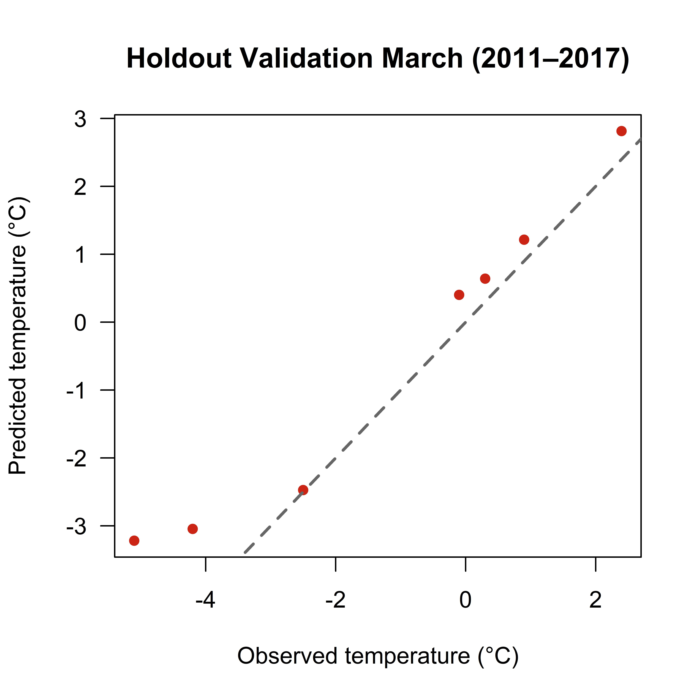
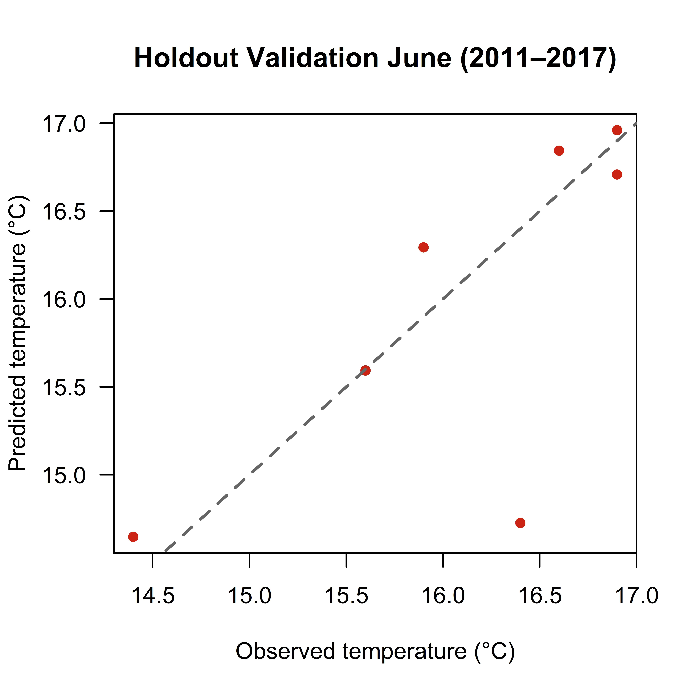
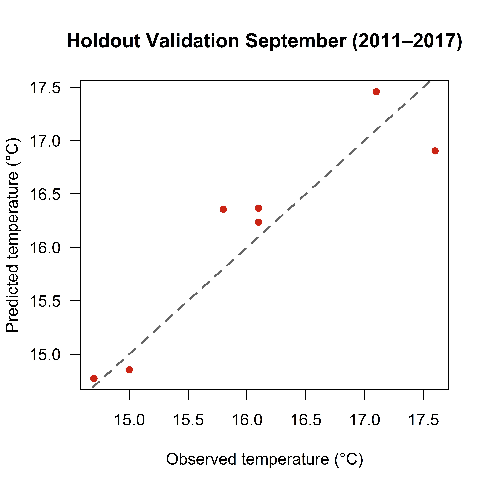
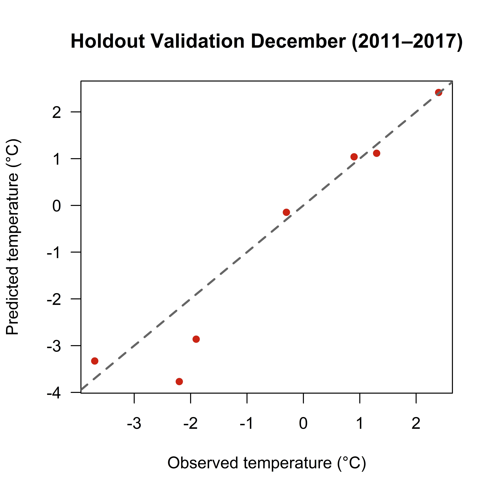

## Statistical Climate Downscaling of Monthly Air Temperature in Greenwood, Nova Scotia

### Project description 
Climate models and global reanalysis datasets provide valuable information for understanding historical and future climate conditions; however, their spatial resolution is often too coarse for local-scale applications. Statistical downscaling provides a computationally efficient method for relating large-scale climate variables to local weather observations, allowing coarse-resolution climate data to be adapted for site-specific analyses. This project developed a statistical downscaling model to predict seasonal air temperatures in Greenwood, Nova Scotia using ERA5 reanalysis data and historical weather station observations. A multiple linear regression model was trained using monthly observations from 1981–2010 and evaluated using both leave-one-out cross-validation and an independent holdout dataset (2011–2018) to assess its forecasting capability.

### Objectives
- Develop a statistical downscaling model relating ERA5 reanalysis temperatures to local station observations.
- Predict seasonal air temperatures for Greenwood, Nova Scotia.
- Evaluate model performance using leave-one-out cross-validation.
- Assess forecasting performance using an independent validation period.
- Compare downscaled predictions with the original ERA5 dataset.

### Study Area
Greenwood is located in the Annapolis Valley of Nova Scotia, Canada. The region experiences a humid continental climate, with seasonal temperature variability influenced by local topography and proximity to the Bay of Fundy. These local influences are not fully represented by coarse-resolution climate datasets, making Greenwood an appropriate location for evaluating statistical downscaling techniques.

### Methodology

### 1. Data Acquisition

Monthly ERA5 reanalysis air temperature data were downloaded in NetCDF format and subset to the Greenwood grid cell. Historical monthly temperature observations were obtained from Environment and Climate Change Canada. ERA5 temperatures were converted from Kelvin to degrees Celsius before further analysis.

### 2. Data Preparation

Both datasets were cleaned, formatted, and aligned into a common monthly time series. Monthly observations between 1981 and 2010 were selected as the calibration dataset for model development. Separate regression models were developed for March, June, September, and December to represent seasonal climate conditions.

### 3. Statistical Downscaling Model

A multiple linear regression model was developed using ERA5 monthly air temperature as the predictor and Greenwood station observations as the predictand. To improve robustness, leave-one-out cross-validation was implemented while accounting for temporal persistence using an autocorrelation-based exclusion window. Regression coefficients were estimated for each validation iteration and averaged to generate the final model.

### 4. Model Evaluation

Model performance was evaluated using three statistical metrics:

Root Mean Square Error (RMSE)
Pearson correlation coefficient (r)
Skill Score (SSC) relative to the original ERA5 dataset

These metrics quantified the degree to which statistical downscaling improved local temperature estimates over the coarse-resolution reanalysis data.

### 5. Forecast Validation

The calibrated regression model was applied to an independent dataset covering 2011–2018 to evaluate predictive performance outside the calibration period. Downscaled predictions were compared directly with observed station temperatures to assess model generalization.

### Sample Code 
Extract ERA5 Temperature

```data_variable <- ncvar_get(
  nc_era,
  "t2m",
  start = c(min(lon_indices), min(lat_indices), 1),
  count = c(length(lon_indices), length(lat_indices), -1)
)

tempc <- data_variable - 273.15
```

Leave-One Out Regression

```for (ii in 1:length(OBSm)) {
  io <- 1:30
  exwin <- (ii - tau):(ii + tau)
  cut <- intersect(exwin, io)
  io <- io[-cut]
  alpha12[ii,] <- coef(
    lm(OBSm[io] ~ REAm[io])
  )

  PREDm[ii] <- alpha12[ii,2] * REAm[ii] +
               alpha12[ii,1]
}
```

Model Evaluation

```rmse_mod12 <- rmse(OBSm, PREDm)
rmse_ref12 <- rmse(OBSm, REAm)

SSC12 <- 1 - (rmse_mod12 / rmse_ref12)

r12 <- cor(OBSm, REAm)
```

### Results and Discussion
The statistical downscaling model produced varying levels of performance across the four seasonal months. Average model performance yielded a Skill Score of 0.42, indicating an improvement over the original ERA5 dataset, while the average RMSE was 1.53°C. However, the average correlation coefficient was −0.06, suggesting that the regression model did not consistently capture observed interannual temperature variability. Performance varied by season, with stronger agreement during March, June, and September than during December. During forecasting, the calibrated regression equations were applied to independent observations between 2011 and 2018. Prediction accuracy differed among seasons, with the smallest forecast errors generally occurring during summer months and larger deviations observed during winter, highlighting the limitations of a simple linear regression approach under varying seasonal conditions.

This project demonstrates the complete workflow required to build and evaluate a statistical climate downscaling model using historical climate observations and ERA5 reanalysis data. Although the model improved upon the original ERA5 temperatures according to the Skill Score, the relatively weak overall correlation indicates that a simple linear regression model is insufficient for accurately representing all aspects of Greenwood's seasonal climate. Local topography, hydrological influences, and other atmospheric processes likely contribute to variability that is not fully captured by a single predictor variable.

<h2>Training Results (1981–2010)</h2>

<div class="gallery">

<div class="gallery-item">
<a href="images/Mar_temps81-10.jpeg">

</a>
<p><strong>Figure 1.</strong> March</p>
</div>

<div class="gallery-item">
<a href="images/June_temps81-10.jpeg">

</a>
<p><strong>Figure 2.</strong> June</p>
</div>

<div class="gallery-item">
<a href="images/Sep_temps81-10.jpeg">

</a>
<p><strong>Figure 3.</strong> September</p>
</div>

<div class="gallery-item">
<a href="images/Dec_temps81-10.jpeg">

</a>
<p><strong>Figure 4.</strong> December</p>
</div>

</div>

<h2>Forecast Validation (2011–2017)</h2>

<div class="gallery">

<div class="gallery-item">
<a href="images/mar_temps2011-17.jpeg">

</a>
<p><strong>Figure 5.</strong> March</p>
</div>

<div class="gallery-item">
<a href="images/June_temps2011-17.jpeg">

</a>
<p><strong>Figure 6.</strong> June</p>
</div>

<div class="gallery-item">
<a href="images/Sep_temps2011-17.jpeg">

</a>
<p><strong>Figure 7.</strong> September</p>
</div>

<div class="gallery-item">
<a href="images/Dec_temps2011-17.jpeg">

</a>
<p><strong>Figure 8.</strong> December</p>
</div>

</div>
### Conclusion
This project demonstrated the application of statistical downscaling to estimate seasonal air temperatures in Greenwood, Nova Scotia using ERA5 reanalysis data and historical weather station observations. A multiple linear regression model was successfully developed, calibrated, and validated using both leave-one-out cross-validation and an independent holdout dataset. While the model improved upon the original ERA5 dataset according to the Skill Score, performance varied by season and highlighted the limitations of simple linear regression for representing complex local climate processes. Overall, the project provided practical experience in climate data processing, statistical modeling, and model evaluation while illustrating both the potential and limitations of statistical downscaling for local climate prediction.

### References
Copernicus Climate Change Service (C3S). (2023). ERA5 hourly data on single levels from 1940 to present (H. Hersbach, B. Bell, P. Berrisford, G. Biavati, A. Horányi, J. Muñoz Sabater, J. Nicolas, C. Peubey, R. Radu, I. Rozum, D. Schepers, A. Simmons, C. Soci, D. Dee, & J.-N. Thépaut). Climate Data Store. https://doi.org/10.24381/cds.adbb2d47 Downloaded from:
https://cds.climate.copernicus.eu/datasets/reanalysis-era5-single-levels?tab=download

Environment and Climate Change Canada. (2025). Historical Climate Data: Greenwood, Nova Scotia weather station. Government of Canada. Downloaded from:
https://climate.weather.gc.ca/historical_data/search_historic_data_e.html

For more details see [GitHub Flavored Markdown](https://guides.github.com/features/mastering-markdown/).
