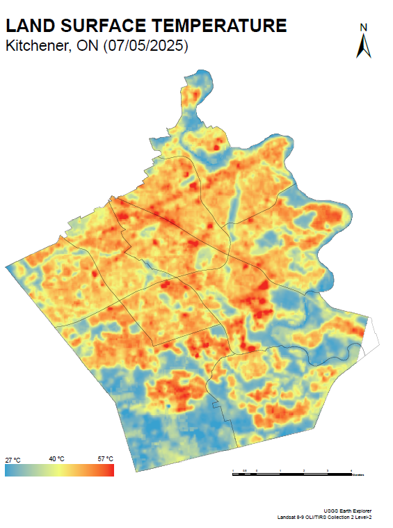
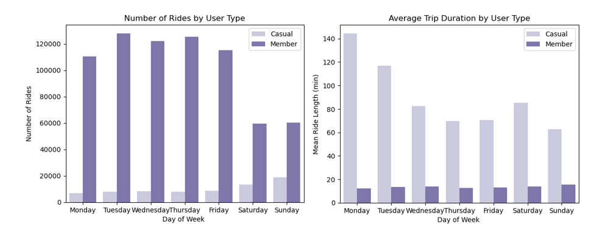
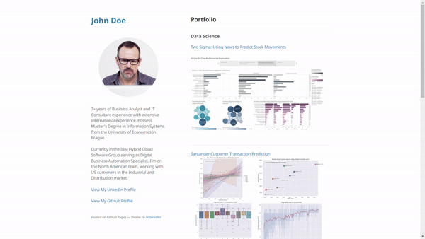

# Portfolio

## Technical Skills

ArcGIS Pro
Remote Sensing
Spatial Analysis
Python
R
SQL
Excel
Google Sheets

## Featured Projects

  
  <h3>Urban Heat Island Analysis — Kitchener, Ontario</h3>
  
Mapped land surface temperature and urban heat hotspots using Landsat imagery and ArcGIS Pro. The project compares hotspots with land cover to identify areas where that contribute to elevated surface temperatures.

  

    ArcGIS Pro
    Landsat
    Raster Analysis
    Cartography
  

  
<a href="hotspots.html">View project →</a>

  
  <h3>Cyclistic Bike Share Analysis</h3>
  
Analyzed bike-share usage patterns to compare casual riders and annual members, using data cleaning, visualization, and business-focused recommendations.

  

    Data Analysis
    Spreadsheets
    Visualization
  

  
<a href="cyclistic_casestudy.html">View project →</a>

  
  <h3>Fitness Dashboard</h3>
  
Built a continuously updating Google Sheets dashboard to track workout progress, strength trends, competition scores, and personal records.

  

    Google Sheets
    Dashboards
    Automation
    Data Visualization
  

